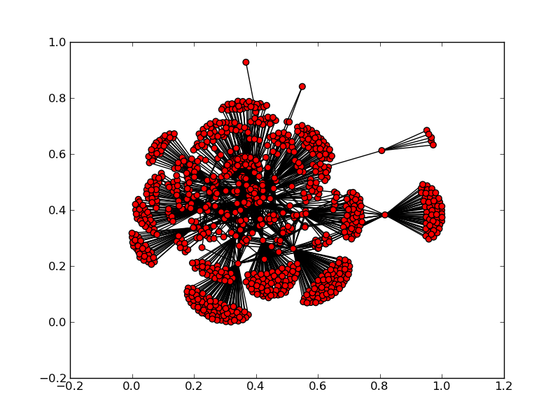

A Basic Web Crawler in Python
==============================

Written as part of a course, 681 - Security Projects taught by Dr. Sebastien Goasguen.

Though the idea was entirely Dr.G's, It was implemented by myself and Vignesh Selvamuthu as a team. Feel free to re-use/modify any of this code.

Sample visualizations using the data obtained from the crawler :

 
